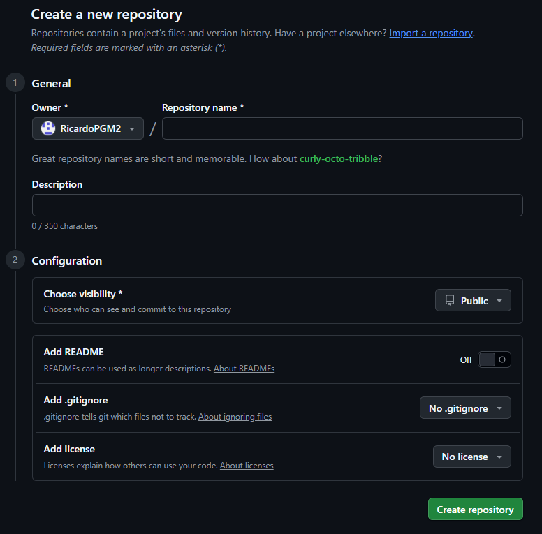
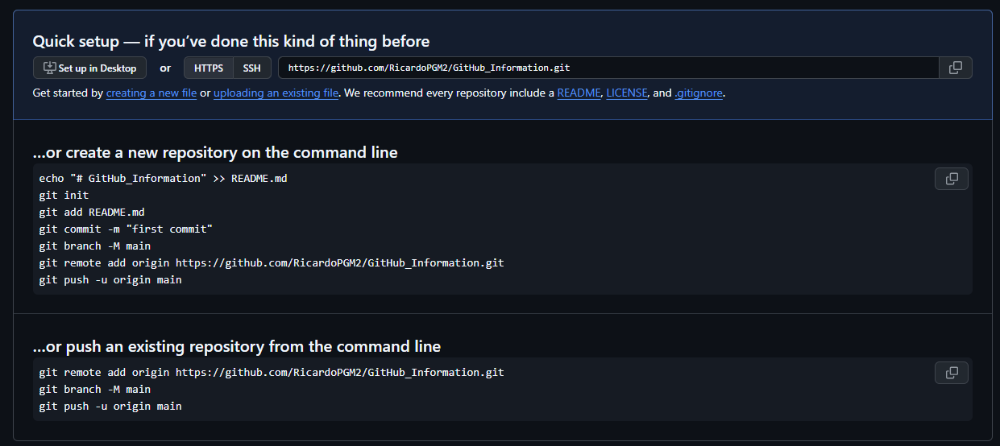

# <p style="text-align: center;">**Guía básica git - Github**</p>

## 1. Instalación.

En primer lugar, se debe instalar git en el ordenador (https://git-scm.com/). 

Una vez instalado, se puede verificar su correcta instalación ejecutando el comando ```git --version``` en el CMD. Debería salir algo así como ```git version 2.54.0.windows.1```.

## 2. Crear cuenta en GitHub

GitHub es un servicio, distinto a git, que es un programa. Para usar git, solo basta con tenerlo instalado. Para usar GitHub, se necesita una cuenta:

Se debe crear una cuenta en GitHub (https://github.com/). El nombre de usuario o el correo electrónico asociado es importante, recuérdalo.

## 3. Vincular cuenta de GitHub con git

Una vez creada la cuenta en GitHub, se debe conectar con git en el ordenador. Para ello, se deben ejecutar dos comandos en el CMD:

- ```git config --global user.name "[nombre de usuario de GitHub]"```
- ```git config --global user.email "[correo electrónico]"```

## 4. Crear la carpeta del proyecto

Una vez vinculado, en el ordenador, se debe crear la carpeta en la que se quiere trabajar y que se quiere manejar como repositorio. Normalmente, en su nombre no se dejan espacios, sino que las palabras del nombre se separan con guiones, ```-```. Por ejemplo, ```GitHub-Information``` o ```Repositorio-General-Pruebas```. Por convención, también se suele evitar el uso de mayúsculas.

Una vez creada, se puede añadir trabajo o no a la carpeta antes de conectarlo con GitHub.

## 5. Abrir el proyecto en *Visual Studio Code*

Tras crearla, se debe abrir la carpeta del repositorio en el que se quiere trabajar en *Visual Studio Code* (*Open Folder → [Repositorio]*).

Esto abre en VS Code la carpeta como el directorio principal de un proyecto. (Esto implica que dentro de esta carpeta aparecerán, por ejemplo, los pdfs que se generen con Python)

## 6. Entrar en GitHub en Internet y crear un repositorio

En [GitHub](https://github.com/) se debe crear un repositorio pinchando en el botón 📕*New*. Lleva a la siguiente página:

<div style="text-align: center;">
  

  <figcaption><strong>Formulario para la creación del repositorio en GitHub.</strong></figcaption>
</div>
<br>

En este ejemplo, el repositorio se ha creado como público, lo que implica que todo el mundo puede verlo, clonarlo, y descargar archivos de aquí. Sin embargo, para poder contribuir, se deben pedir permisos, como se puede ver más adelante.

Una vez creado, aparecen instrucciones para conectar el repositorio con los archivos locales:

<div style="text-align: center;">
  

  <figcaption><strong>Comandos del repositorio en GitHub.</strong></figcaption>
</div>

## 7. Conectar el repositorio de GitHub con el local

Ahora, empleando *Visual Studio Code*, se procede a conectar el repositorio creado en GitHub con los archivos locales.

### En el caso de tener un repositorio vacío o querer descartar lo que haya allí

Para ello, abrimos en *Visual Studio Code* una *Terminal* en la carpeta que queramos conectar. En este se escriben en orden los siguientes comandos:

- ```git init```: inicializa un repositorio de git local en nuestro equipo.
- ```git remote add origin [https://github.com/](https://github.com/)[nombre de usuario]/[nombre del repositorio remoto].git```: penúltima línea indicada en las instrucciones de GitHub para conectar el repositorio con los archivos locales. Vincula el repositorio local con el remoto.

### En el caso de querer vincular un repositorio existente (y con contenido)

Se puede navegar con la terminal o abrir directamente dentro de la carpeta dentro de la cual se quiera colocar el repositorio. Este proceso resultará en **una carpeta con el nombre del repositorio** dentro de la ubicación donde se ejecute el comando. Una vez allí, se ejecuta:

```bash
git clone [URL_DEL_REPO]
```

Por cuestiones de fiabilidad, la URL del repo se puede conseguir del botón `code` que aparece en la página principal, y la opción SSH es la más robusta para este comando.

<div style="text-align: center;">
    
    <br>
</div>

Este comando podría fallar si el usuario de GitHub no tiene permisos o no es colaborador en un repositorio privado.

## 8. Empezar a añadir y preparar cambios

Una vez inicializado, puede que ya se tuvieran cambios en el repositorio local o no. Para verlo, se puede ejecutar el comando `git status`, que da información sobre el estado del repositorio, los archivos, y si están siendo *trackeados*, además de si se está haciendo un *merge* o un *rebase*. Si aparecen archivos en rojo es que no están siendo *trackeados*, hay cambios que actualizar.

Para que git comience a *trackear* los archivos y los actualice, se deben añadir al *Staging area*. Para ello, se debe emplear uno de los siguientes comandos:

* `git add [nombre del archivo añadido con su extensión]`: agrega el archivo `[nombre del archivo añadido con su extensión]` al commit, que aparecería en rojo en el *Terminal* al ejecutar `git status`.
* `git add .`: agrega todos los archivos en el directorio donde se ejecuta al *Staging Area*. Si ya estaban dentro, no pasa nada. Es la mejor forma de asegurarse de que se añaden todos los archivos que estaban en rojo.

Si se vuelve a ejecutar `git status`, los archivos anteriores aparecen en verde.

Con esto, ya se puede hacer el commit. Para ello, se debe ejecutar el comando `git commit -m "[descripción deseada para caracterizar el commit]"`. Al hacerlo, aparece una breve descripción de lo que ha ocurrido. Un commit es una 'foto' del estado actual de la carpeta de trabajo (el repositorio), de forma que se guardan los cambios y se podría volver atrás a él.

De esta manera, localmente, ya está todo preparado para subirlo a GitHub. Es recomendable volver a ejecutar antes `git status` para verificar que todo se ha almacenado correctamente y no hay errores.

## 9. Subir cambios a GitHub

Para subir los cambios a GitHub, se debe ejecutar el comando `git push`.

* En caso de que sea la primera vez que se sube información al repositorio remoto, se va a producir un error, porque no se ha creado la *branch* necesaria. Por tanto, se debe establecer esta *branch* antes de poder hacer *push*. En el *Terminal*, git ya ofrece el comando que se debe emplear, `git push --set-upstream origin main`. Al hacerlo, aparece que ya sí se ha subido el contenido a GitHub.

El nombre de la rama principal antiguamente era `master`, pero esto está siendo deprecado y la mayoría de repositorios utilizan la nueva convención de llamar a la rama principal `main`.

Ahora, si vamos al repositorio en GitHub, se puede ver que se han producido las modificaciones y se incluye la descripción para los archivos que corresponde, de esta forma:

## 10. Limitar los archivos subidos a GitHub (`.gitignore`)

Si no se desea que se suban todos los archivos locales al repositorio remoto, se debe crear un archivo `.gitignore` en el primer nivel dentro de la carpeta del repositorio. En este, se incluyen las extensiones, carpetas o archivos que se quieran o no incluir al hacer `git add .` empleando la sintaxis de `bash`. Por ejemplo:

```bash
# Para que no se suban extensiones, archivos o carpetas a GitHub innecesariamente.

# No se incluya cualquier carpeta llamada "out".
**/out/*
# Sí se incluya cualquier .pdf dentro de cualquier carpeta "out".
!**/out/*.pdf 
# No se incluyan los archivos de una extensión ubicados en cualquier nivel.
*.log
*.aux
*.f06

```

Hay que tener en cuenta que, en caso de añadir extensiones o archivos al  `.gitignore` después de que estas ya existan en el *staging area*, git no las comenzará a ignorar, y no desaparecerán de GitHub. En este caso, se debe escribir el comando `git rm --cached -r .`, que elimina todos los archivos del *staging area*. A partir de aquí, `git add .` respetará las normas del `.gitignore`.

## 11. Bajar cambios realizados por otros usuarios

Si se trabaja en un proyecto en grupo, cuando otros usuarios con acceso al repositorio remoto realizan cambios y los suben a GitHub con `git push`, para poder trabajar localmente con la versión más actualizada, se debe descargar localmente esa última versión. Para ello, se debe ejecutar en el *Terminal* del repositorio el comando `git pull`.

Merece la pena mencionar que la forma estándar de comprobar si ha habido trabajo en el repositorio remoto que no se tiene en el local es ejecutar la secuencia `git fetch` + `git status`, que recibe, detecta e indica las diferencias entre repositorios. Tras esto, se ejecuta `git pull`.

En caso de que varios usuarios hayan hecho cambios y quieran hacer `git push` desde repositorios locales en diferentes estados, aparece un error en el *Terminal* del que haga `git push` más tarde. Para resolverlo, se debe *mergear* todo a una versión final, decidiendo qué cambios se quieren mantener en esta última versión. Para ello, se debe hacer primero `git pull`. Después, se corrigen los conflictos en los archivos directamente o con el *Merge Editor* de *Visual Studio Code*, que hace un posterior `merge`, generando la versión final con los cambios combinados según se desee. Finalmente, ya se puede seguir la secuencia habitual para subir cambios (`git add .` + `git commit -m "[descripción]"` + `git push`). De esta manera, ya se subiría al repositorio remoto una versión actualizada que combina los cambios simultáneos realizados por los dos usuarios.

* Es posible que al hacer esto en *Visual Studio Code*, el *Terminal* se quede en modo *rebase* o *merge*, impidiendo continuar con los comandos necesarios para subir los cambios al repositorio remoto. Para salir de estos modos, se pueden ejecutar los siguientes diferentes comandos:
* `git merge --abort`: aborta el merge, y vuelve al estado anterior a ejecutar `git pull`.
* `git rebase --abort`: aborta el rebase, y vuelve al estado anterior a ejecutar `git pull`.

Si se quiere evitar esto para la próxima vez, se puede cambiar la configuración de `git`:

* `git config pull.rebase false` : Evita entrar en modo *rebase* la próxima vez que sea necesario hacer un *merge* en este repositorio.
* `git config --global pull.rebase false` : Evita entrar en modo *rebase* la próxima vez que sea necesario hacer un *merge* en todos los repositorios (configuración global de `git`).

Supuestamente, basta con ejecutar una vez el comando deseado para que el *Terminal* ya no se quede en esos modos y vuelva por defecto al funcionamiento habitual tras hacer un *merge* o *rebase*. Sin embargo, la terminal de *VS Code* a veces se pone exquisita, y todavía no se ha encontrado una buena forma de evitar esto.

## 12. Descargar el repositorio remoto de otro usuario

Para trabajar de la forma indicada pero en un repositorio creado por otro usuario, se debe navegar a una carpeta donde se quiera copiar el repositorio. Abriendo una terminal en esa carpeta, se debe ejecutar el comando:

```bash
git clone [url del repositorio de GitHub]

```
Que crea una copia local del repositorio remoto y lo conecta con GitHub.

A partir de aquí, ya se cuentan con todos los archivos. Si se tienen permisos de escritura (el propietario del repositorio remoto ha añadido al usuario como colaborador), se puede utilizar el flujo de trabajo estándar. Si no, se debe consultar la sección de **colaboración sin ser colaborador**.

## 13. Ver el historial de cambios (`git log`)

Para consultar los commits realizados:

```bash
git log --oneline
```

Muestra una línea resumida por commit con su ID (el hash) y mensaje, útil para identificar referencias al usar `git reset`. Es posible que la *Terminal* se quede 'ocupada' después de ejecutar este comando. Para solucionarlo, simplemente hay que pulsar la tecla `q` (minúscula).

## 14. Revertir commits (`git reset`)

Si necesitas deshacer un commit (por ejemplo, tras añadir un archivo que supera el límite de 100 MB de GitHub):

```bash
git reset --[tipo] [commit-ID]
```
Tipos de reset:

* `--hard`: Restaura el repositorio y los archivos exactamente al estado del commit (se pierden los cambios locales no guardados).
* `--soft`: Mantiene los archivos locales intactos y deja todos los cambios posteriores en el *staging area*.
* `--mixed`: Mantiene los archivos locales intactos pero vacía el *staging area* al estado del commit indicado.

**Ejemplo para eliminar un archivo grande (ej. `.f06`) ya commiteado:**

Si no está claro en qué commit se ha añadido el archivo, pero no se están subiendo los commits al repositorio remoto (a GitHub), se pueden eliminar los commits locales **sin perder el trabajo** y eliminar del *staging area* el archivo grande.

```bash
git reset --mixed origin/main #mixed para conservar los archivos locales
git add .
git rm --cached *.f06 #eliminamos todos los archivos con extensión .f06
git commit -m "Corregir commit y excluir .f06"
git push
```

## 15. Crear una rama de trabajo

Para trabajar de forma más correcta y no afectar al trabajo de otros, se pueden crear ramas de trabajo independientes que, si bien mantienen la misma lógica de comandos ya descrita, se separan de la rama principal y no la afectan. Después, se pueden *mergear* con la principal si así se desea.

Para ver todas las ramas que hay abiertas en el repositorio local, se puede ejecutar
```bash
git branch
```
Para ver todas las ramas que hay abiertas en el repositorio local y en el remoto (a la vez) se puede ejecutar:
```bash
git branch -a
```

Antes de crear una nueva rama, si estamos en `main`, es altamente recomendable ejecutar `git pull` para asegurarnos de que la rama parte del estado más reciente de `main`.

Para crear una rama, se debe ejecutar el comando:
```bash
git branch [nombre de la rama]
```

Después, para cambiarte a esta y trabajar en ella, se debe ejecutar:
```bash
git checkout [nombre de la rama]
```
Aquí ya se trabaja de la forma habitual.

* Se pueden unir ambos pasos con el comando `git checkout -b [nombre de la rama]`, que crea la rama y te cambia a esta.
* Cuando se haya terminado el trabajo y se quiera subir un *commit* al repositorio remoto, hay que indicarle a `git` que ahora tiene que subir los cambios a una rama nueva. `git` es lo suficientemente listo como para dar el error si ya se ha ejecutado el comando `git checkout`. Entonces, después del flujo de trabajo estándar:

```bash
git add .
git commit -m "descripción de los cambios"
```

Se debe añadir al `git push` la bandera `-u [nombre-rama]`:

```bash
git push -u origin [nombre-rama]
```

Una vez terminado el trabajo deseado en la rama, se puede *mergear* con la rama principal (generalmente llamada `main` o `master`). Para ello, se ejecuta el comando `git checkout [nombre de la rama que se quiere mantener, normalmente main o master]` para trasladarse a la rama deseada, y después `git merge [nombre de la rama que se desea mergear]`. Se puede ejecutar un `git pull` entre medias para cargar posibles cambios en la rama `main` o `master` y que no haya conflictos.

Por ejemplo, para hacer el merge de *característica* con *main*, el flujo de trabajo sería:

1. `git checkout main`
2. `git merge caracteristica`
3. Resolver posibles conflictos en el *merge*.

Además, si se desea eliminar una rama en tu repositorio remoto de GitHub una vez ya se ha mergeado con `main`, se debe ejecutar el comando:

```bash
git push origin --delete [nombre de la rama a borrar]
```

## 16. Tokens de Acceso Personal (PAT) para máquinas virtuales

Para clonar o operar en entornos remotos donde el inicio de sesión web no es viable:

1. En GitHub: Perfil $\to$ *Settings* $\to$ *Developer settings* $\to$ *Personal access tokens* $\to$ *Fine-grained tokens* $\to$ *Generate new token*.
2. Seleccionar *All repositories*.
3. En *Permissions*, configurar con permisos de lectura y escritura (*Read and write*):
* *Contents*
* *Pull requests*
* *Commit statuses* (El campo *Metadata* se añadirá automáticamente en modo lectura).

4. Generar, copiar el token y usarlo como contraseña al autenticarte en la terminal remota.

# Colaboración en GitHub

El principal motivo por el que se ha decidido utilizar esta herramienta para la colaboración en el Club de Vuelo es el control de versiones y su versatilidad. Si bien la longitud de esta guía demuestra que es algo complejo de utilizar, la combinación git + GitHub permite tener disponibilidad siempre para que cualquier miembro pueda acceder a los diseños, códigos y documentación del Club.

En esta sección se explica cómo se puede colaborar. Existen dos formas principales.

## A) Sin ser colaborador

No se puede colaborar directamente a un repositorio a no ser que el propietario haya añadido al usuario como colaborador. Sin este permiso, el flujo de trabajo es el **Fork y Pull-Request**.

### 1. Haz un Fork del Repositorio

En la página de GitHub del repositorio original, haz click en el botón de **Fork** (arriba a la derecha). Esto creará una copia del repositorio original, de la que eres propietario, pero está vinculada al repo original.

### 2. Clona tu *Fork*

Clona la URL del *Fork* que se acaba de crear:

```bash
git clone https://github.com/[tu-username]/[nombre-repo].git
```

### 3. Haz una nueva rama y commits

Haz una nueva rama, haz los cambios, y haz el commit para guardarlos localmente:

```bash
git checkout -b nombre-rama
git add .
git commit -m "Description of changes"
```

### 4. Haz push a tu *Fork*

Como el propietario del *Fork* eres tú, tienes permisos para poder subir los cambios al remoto:

```bash
git push -u origin nombre-rama
```

### 5. Crea una solicitud de Pull (*Pull Request*, PR)

Ve a la [página web del repositorio original](https://github.com/Ohmyus/club-de-vuelo) en GitHub. Un banner aparecerá automáticamente sugiriendo abrir un *Pull Request*. Haz click en "Comparar y Pull Request", añade una descripción de tus cambios o trabajo para ayudar al revisor, y envíala. Entonces el propietario o colaboradores del repositorio podrán revisar, aprobar y *mergear* tu trabajo o código en el repositorio.

### 6. Mantente actualizado

Es posible que durante el tiempo que estés trabajando, el repositorio original reciba *commits*, que al trabajar en una copia del repositorio, no se aplican automáticamente al *fork*.

Para mantener sincronía con el repositorio original, en GitHub existe el botón **Sync Fork**, que se encarga de aplicar los commits en el repositorio original al *fork*.

Se puede hacer todo este trabajo de forma local, definiendo un repositorio 'upstream' con la dirección del repo original. De esta forma, luego se puede hacer `git pull` de los cambios que se hayan hecho en el repo original.

1. Define 'upstream':
```bash
git remote add upstream [url-del-repo-original.git]
```

2. *Pull* de los cambios más recientes al repo local
```bash
git pull upstream main
```

3. Después de hacer el *commit*, `push` al repo *forkeado*:
```bash
git push origin main
```

## B) Siendo colaborador

Para ser colaborador en un repositorio, se le debe pedir al propietario que te añada como colaborador. Una vez hecho esto, el funcionamiento es el mismo que habría si se fuera propietario del repositorio.

# Resumen

## Subir cambios a GitHub

Cada vez que se quieran subir cambios al repositorio, se deben realizar los siguientes pasos:

* #### 0. Realizar los cambios en el repositorio local y guardar: `Ctrl + s`.
* #### 1. Abrir el *Terminal* en la carpeta del repositorio (Ctrl + ñ en *VS Code*).
* #### 2. (opcional, para comprobar que hay *unstaged changes*) `git status`
* #### 3. `git add .`
* #### 4. (opcional) `git status`)
* #### 5. `git commit -m "[mensaje descriptivo]"`
* #### 6. (opcional) `git status`)
* #### 7. `git push`
* #### 8: Verificar en GitHub la correcta actualización del repositorio.

## Gestión de `.gitignore`

* #### 1. Crear el `.gitignore` antes de que existan los archivos que se quieren ignorar.
* #### (2.) En caso de que se hayan generado archivos que se deciden ignorar posteriormente, actualizar el `.gitignore` y usar el comando `git rm --cached -r .`

## Bajar cambios de GitHub

* #### 1. `git fetch`
* #### 2. `git status`
* #### 3. `git pull`

## Resolver conflictos al hacer `git push`

* #### 1. `git pull`
* #### 2. *Mergear* los cambios de la forma deseada.
* #### 3. `git add .`
* #### 4. `git commit -m "[descripción]"`
* #### 5. `git push`

## Crear y *mergear* ramas

* #### 1. `git checkout -b [nombre de la rama]`
* #### 2. Subir y bajar cambios de GitHub de igual forma que en la rama `main`
* #### 3. `git checkout main`
* #### 4. `git merge [nombre de la rama]`
* #### (5.) Si se quiere eliminar del repositorio remoto, `git push origin --delete [nombre de la rama]`

## Descargar y conectar repositorio remoto

* #### 1. `git clone [url del repositorio de GitHub]`

## Colaborar sin ser colaborador en el repositorio:

* #### 1. Hacer un Fork del repositorio
* #### 2. Clonar el repositorio *forkeado*: `git clone [url del repo forkeado]`
* #### 3. Abrir una nueva rama: `git checkout -b nombre-descriptivo`
* #### 4. Haz el trabajo, puedes ir haciendo *commits* para ir guardando tu progreso:
```bash
git add .
git commit -m "Añadido algo"
```

* #### 5. Sube los cambios a la rama que has abierto:

```bash
git add .
git commit -m "terminado el trabajo en nombre-descriptivo"
git push -u origin nombre-descriptivo
```

* #### 6. Crea una *Pull Request*
