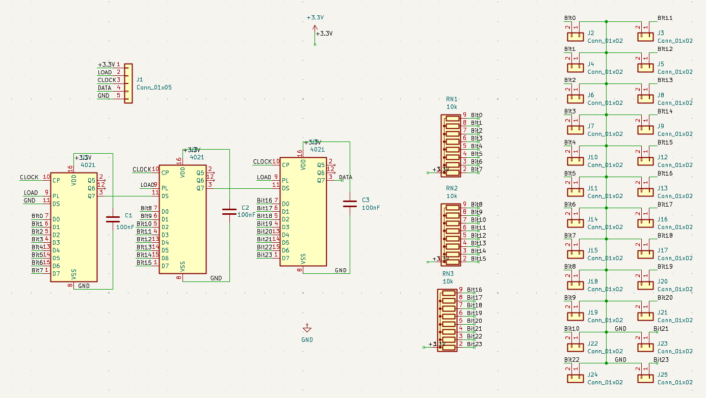

## Stick PCB

En este directorio están todos los archivos relevantes para el diseño del PCB interno de los grips. Este PCB busca ser compatible con las bases estándar (Thrustmaster, Virpil, Moza), utilizando el conector 5-pin Mini-DIN y (hasta) tres registros de desplazamiento.

### Estado del proyecto

Actualmente este proyecto está en desarrollo, habiendo alcanzado los siguientes hitos:
* Completado el diseño básico del circuito (en `stick-pcb.kicad_sch`)

El trabajo restante consiste en:
* Añadir en el diseño del circuito la opción de que los botones se puedan conectar de diversas formas.
* Diseñar el PCB físico, atendiendo a los requisitos:
- Polivalencia: debe poder adaptarse a varios *grips*
- Versatilidad: debe incluir conexiones para soldar cables directamente o conectores (mejorando el *cable-management* dentro del *grip*).

### Visión general:

El diseño del circuito utiliza (hasta) tres registros de desplazamiento. Estos son componentes pasivos que están conectados a la electrónica de la base mediante el conector estándar 5-pin Mini-DIN.

Los botones están conectados a los registros de desplazamiento, de forma que el PCB centraliza el flujo de la información a la base. Cada uno de los registros de desplazamiento permite leer 8 bits, para un total de 24 botones en el grip.

Además, cada uno de los registros de desplazamiento debe estar conectado a una entrada, el reloj (controlado por la base), los botones que controla, y debe tener un condensador de desacoplamiento entre su $V_{SS}$ y $V_{DD}$.

Los botones están configurados como *pullups*, es decir, que los registros de desplazamiento están leyendo el nivel alto de lógica (3.3V) por defecto, y cuando se actúa el botón, pasan a leer el nivel bajo de lógica (0 V o GND).

 

	
      
	<figcaption><strong>Esquema del circuito (KiCad)</strong></figcaption>

#### Componentes del circuito:

- **Conector p2.54 de 5 pines**: para las conexiones del conector 5-pin Mini-DIN.
- **3x CD4021B Shift Registers**: para la lectura del estado de cada botón.
- **3x Resistor Network**: Conjuntos de resistencias para configurar los botones como *PULLUP*.
- **24x SPST switches**: Puntos de conexión de cada botón.
